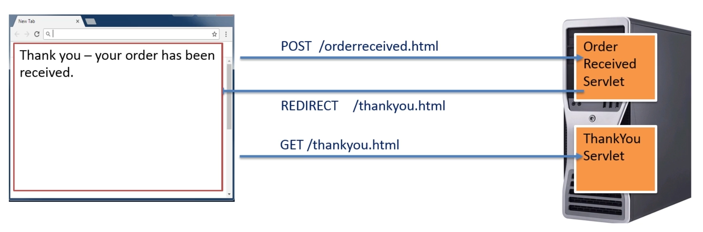

# Servlets: Restaurant

## Step 5: Allow ONLY POST or GET

1. We need to replace the ``service()`` method for the ``doPost()`` or the ``doGet()`` methods.

When a form is set to use the POST verb but the servlet **only** has the ``doGet()`` method implemented, we get a "_Http Status 405 - Http method POST is not supported by this URL_".

Similarly, if the form is set to use the GET method but the servlet **only** has the ``doPost()`` method implemented, we get a similar 405 error.

> Within a single servlet, we can have both the ``doGet()`` **and** the ``doPost()`` methods simultaneously.

Having both methods is quite common and allows the servlet to work with any werb from the form, **doing different things depending on what verb is used in the form** (as opposite of using only the ``service()`` method).

- Using only ``doPost()`` with the form sending the request via the POST verb, even with a warning from the browser, the end user still can resend the request, by refreshing the page, and then **the order is duplicated** !! . 

> To avoid or get around this _"refreshing"_ problem, we need to use a **design pattern** for web development called **``POST-REDIRECT-GET``**.

## The ``POST-REDIRECT-GET`` pattern

> If the user refreshes, it's not going to resubmit the post, but the latest action which is a GET.

[Http status codes](https://en.wikipedia.org/wiki/List_of_HTTP_status_codes)

Redirect uses 301 (permanent redirect) or 302 (temporary redirect) or 303:

> **303 See Other (since HTTP/1.1)**  
The response to the request can be found under another URI using the GET method. When received in response to a POST (or PUT/DELETE), the client should presume that the server has received the data and should issue a new GET request to the given URI.

